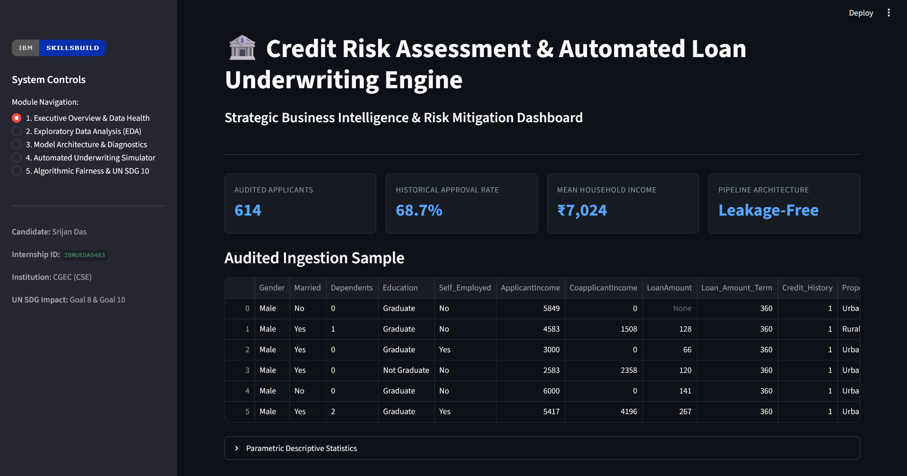

# Loan Approval Prediction Dashboard

A Streamlit decision-support dashboard for exploring loan approval patterns and evaluating a Random Forest classification model trained on 614 historical applicant records.

> **Key Results at a Glance:**
> - **81.3%** holdout accuracy on 123 test applications (100 of 123 correctly classified)
> - **74.7% ± 5.1%** accuracy across 5-fold stratified cross-validation
> - **+6.0 percentage points** improvement over the naive majority-class baseline (68.7%)
> - **0.85 ROC-AUC score** demonstrating class discrimination
> - **0.966** historical female-to-male approval-rate ratio (`Gender` omitted from training features)
>
> [Read the full project report (PDF)](./reports/project_report.pdf) · [View verification script](./scripts/verify_metrics.py)

---



---

## 📌 Business Use Case

In retail lending, credit analysts balance expanding loan volume with keeping default rates low. This prototype assists an analyst to:
- Inspect historical relationships between applicant finances, requested loan amounts, and credit history.
- Evaluate model predictions alongside estimated debt-to-income (DTI) metrics.
- Review demographic approval rates prior to considering automated decision support.

> **Scope & Limitations:** This is an educational prototype trained on 614 records from a public Kaggle dataset. It is designed to assist human review, not serve as an autonomous credit-scoring system.

---

## 📊 Results Summary

| Metric | Score | Context / Interpretation |
| :--- | :--- | :--- |
| **5-Fold CV Accuracy** | **74.7% ± 5.1%** | Generalized baseline across validation folds |
| **Majority-Class Baseline** | **68.7%** | Naive "always approve" strategy |
| **Net Improvement** | **+6.0 percentage points** | Empirical model lift over naive baseline |
| **Holdout Test Accuracy** | **81.3%** | Evaluated on 123 unseen test records |
| **Precision (Approval Class)**| **87.8%** | 72 of 82 predicted approvals were correct |
| **Recall (Sensitivity)** | **84.7%** | Correctly identified 72 of 85 approved applicants |
| **ROC-AUC Score** | **0.85** | Strong class separability on test cohort |
| **Disparate Impact Ratio** | **0.966** | Historical female/male approval-rate ratio |

---

## 🛠️ How the Model Works

- **Leakage-Free Imputation:** Preprocessing is wrapped inside a Scikit-Learn `Pipeline` with `SimpleImputer(strategy='median')`. Imputation statistics are computed strictly within training folds to eliminate distributional leakage.
- **Feature Engineering:** Computes total household income (`ApplicantIncome + CoapplicantIncome`), estimated monthly payments (`EMI_Estimate`), and debt-to-income (`Debt_To_Income`) prior to pipeline entry.
- **Model Architecture:** Random Forest Classifier (`n_estimators=120`, `max_depth=5`, `class_weight='balanced'`).
- **Primary Observed Associations:** In this dataset, applicants with a recorded credit history had an approval rate above 79%, compared to below 10% for applicants without one.

---

## ⚖️ Fairness & Ethical Considerations (UN SDG 10)

This project addresses **UN SDG 10 (Reduced Inequalities)** by testing for demographic parity:
- **Feature Exclusion:** `Gender` is excluded from the model feature set so decisions are driven by credit history and debt-servicing capacity.
- **Disparate Impact Screening:** Historical records show an approval rate of 66.9% for female applicants and 69.3% for male applicants, yielding a ratio of **0.966** (satisfying the regulatory Four-Fifths screening threshold of $\ge 0.80$).
- **Limitation:** Omission of a sensitive attribute does not guarantee complete fairness, as correlated proxy variables may still exist. A production audit would require subgroup error-rate evaluation.

---

## 📂 Repository Layout

- [`app.py`](./app.py): Streamlit application and ML pipeline.
- [`data/train_loan_data.csv`](./data/train_loan_data.csv): Kaggle benchmark dataset.
- [`scripts/verify_metrics.py`](./scripts/verify_metrics.py): Script to locally reproduce the reported validation metrics.
- [`reports/project_report.pdf`](./reports/project_report.pdf): PDF report describing the dataset, model, and validation results.
- [`requirements.txt`](./requirements.txt): Direct project dependencies.
- [`requirements.lock`](./requirements.lock): Full environment freeze used for the reported run.
- [`runtime.txt`](./runtime.txt): Python runtime used for development (Python 3.14).

---

## 🚀 How to Reproduce & Run Locally

1. Reproduce Validation Metrics
```bash
python scripts/verify_metrics.py

```
2. Launch the Streamlit Dashboard
```bash
# Clone the repository
git clone https://github.com/Srijan9073/ibm-skillsbuild-analytics-capstone.git
cd ibm-skillsbuild-analytics-capstone

# Install dependencies
pip install -r requirements.txt

# Launch the dashboard
streamlit run app.py

```
---

## 👨‍💻 Candidate & Submission Details
- **Candidate:** Srijan Das
- **Internship ID:** `IBMUEDA0483`
- **Institution:** Cooch Behar Government Engineering College (CGEC)
- **Program:** AICTE–BharatCares–IBM SkillsBuild Data Analytics with AI Virtual Internship
- **LinkedIn:** [linkedin.com/in/srijandas2099](https://www.linkedin.com/in/srijandas2099/)
